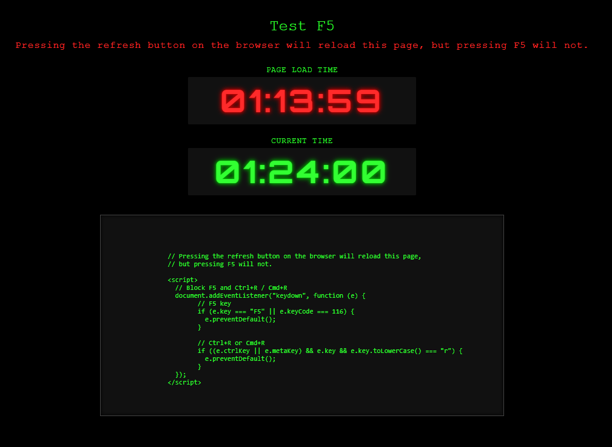

# DontReloadMe

This project demonstrates how to intercept and block browser refresh actions such as F5 and Ctrl+R. It includes a test page that displays two digital clocks on a black background. The first clock shows the time when the page was loaded and the second displays the current time, updating every second. Both clocks use a seven-segment digital style.

The page also shows the JavaScript snippet used to block refresh actions in a formatted code box for reference.



## Features

- Prevents F5, Ctrl+R, and Cmd+R from refreshing the page.
- Displays the page load time in red.
- Displays a real-time digital clock in green.
- Seven-segment visual style with a black background.
- Includes the refresh-blocking script rendered as a code sample on the page.

## Purpose

This is intended for testing how browser refresh prevention behaves in different environments. It can also help with demonstrations or UI experiments that rely on preventing a user from reloading a page during a workflow.

## Files

- `DontReloadMe.html`  
  The main test page containing both clocks, styling, and the refresh-blocking logic.

## Usage

Open the HTML file in a browser. The page will display both clocks and will block refresh actions triggered by F5 or common shortcut keys.

## Using dontreloadme.js

The repository includes a standalone JavaScript file named `dontreloadme.js`. It contains the logic that blocks page reload actions such as F5, Ctrl+R, and Cmd+R.

To enable this behavior in your own HTML file, add the script tag below inside the `<head>` or at the end of the `<body>`:

```html
<script src="dontreloadme.js"></script>

## Notes

Modern browsers may still allow refresh using menus or other user interface controls. This is expected and aligns with browser security and usability rules.

## License

You may use or modify this project as needed.
